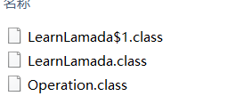

# lambda表达式总结
## 基本概念
lambda表达式是java 8 引入的一个重要特性，其主要目的是简化匿名内部类的写法，相比于匿名内部类，lambda可以使用更加优雅的方式表达同样的逻辑。lambda表达式
描述了一个代码块（也叫匿名内部类）。
## lambda表达式基本原理


如图，编译后产生了3个class文件，其中接口Class以及匿名内部类文件。
1、lambda 表达式并不产生类文件。lambda表示必须与一个函数式接口相关联。其中函数式接口
2、函数式接口： 只包含一个抽象方法的普通接口。
3、lambda 表达式的简单实现，直接将箭头-> 通过javac反编译成匿名内部类就可以了。
但实际上反编译后并没有。


lambda表达式实现原理,反编译字节码，查看main 方法code，可以看到，16 行有invokespecial  也就是 lamda表达式的初始化。后面有三次interface的
调用。 
几个invoke指令

invokedynamic 与动态类型有关系，在运行时决定调用。
invokespecial 主要是用来得到对象在堆中的地址，这样就可以使用整个继承链路上的所有父类。

```jsunicoderegexp
 0 invokedynamic #2 <operation, BootstrapMethods #0>
 5 astore_1
 6 invokedynamic #3 <operation, BootstrapMethods #1>
11 astore_2
12 new #4 <com/ygh/learn/lamada/LearnLamada$1>
15 dup
16 invokespecial #5 <com/ygh/learn/lamada/LearnLamada$1.<init> : ()V>
19 astore_3
20 getstatic #6 <java/lang/System.out : Ljava/io/PrintStream;>
23 aload_1
24 iconst_1
25 iconst_2
26 invokeinterface #7 <com/ygh/learn/lamada/Operation.operation : (II)I> count 3
31 invokevirtual #8 <java/io/PrintStream.println : (I)V>
34 getstatic #6 <java/lang/System.out : Ljava/io/PrintStream;>
37 aload_2
38 iconst_1
39 iconst_2
40 invokeinterface #7 <com/ygh/learn/lamada/Operation.operation : (II)I> count 3
45 invokevirtual #8 <java/io/PrintStream.println : (I)V>
48 getstatic #6 <java/lang/System.out : Ljava/io/PrintStream;>
51 aload_3
52 iconst_1
53 iconst_2
54 invokeinterface #7 <com/ygh/learn/lamada/Operation.operation : (II)I> count 3
59 invokevirtual #8 <java/io/PrintStream.println : (I)V>
62 return
```
## 参考资料：
https://www.jianshu.com/p/6c2bfc0744c4
